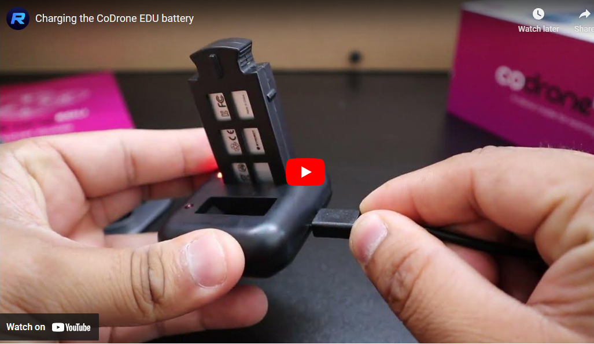
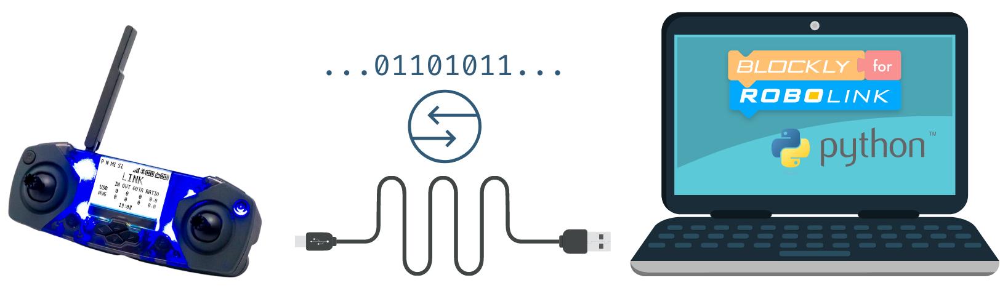

# Recitation Lab 1 - Powering, Pairing, and Flying using Python

## Objective
By the end of this lab, a student will be able to
 
1. power the drone using the battery
2. Pair the drone to the controller
3. Power the controller via USB
4. Run python code with Codrone EDU
5. Troubleshoot python programming and connection issues
7. Takeoff, land, and hover the drone using both the controller and Python

## Installing CoDrone EDU library

In order to program the drone, you will need to install the CoDrone EDU package.  This package provides a library that will allow us to control the CoDrone using Python. There are two ways to install the library.

### From the Terminal

To install the CoDrone EDU library using the terminal,

1. Open the terminal from the launcher. Windows users can use PowerShell.
2. At the command prompt type, **pip install codrone-edu**
3. Wait for the installation to complete.  Don't worry if it complains that your pip version is outdated.
4. You are now set.

### From PyCharm

To install the library, open the PyCharm IDE.  Perform the following,

1. Select *Customize* from the left panel of the PyCharm startup screen.  If you have an open project, please close the project to return to the startup screen.
2. Click on *All Settings*.
3. Select *Python Interpreter* from the left panel.
4. Select Python 3.7 using the drop down for **Python Interpreter**.  Note: If it says \<No Interpreter\> and you cannot find Python 3.7 listed in the drop down list, then exit PyCharm and install or reinstall Python 3.7.9 from https://python.org.
5. You should now see a list of packages appear.  To add the CoDrone package, click on the **+** above the Package column and type **codrone** in the search box at the top.
6. Select the **codrone-edu** package and click on the **Install Package** button.
7. Once the package is installed, exit from the available packages screen.  Make sure the **codrone-edu** package is in the list of packages on the screen.  Click the **OK** button to continue.
8. You have now installed the CoDrone package system-wide.

## Powering, Charging, and Pairing the Drone

### Powering on the Drone

To power on the drone, insert the battery into the slot at the bottom of the drone. Hold the drone right side up with the red propellers away from you. Insert the battery with the notch facing down and closest to you. The LED should turn on and you will hear a beep from the drone.


### Powering Off the Drone

To power off the drone, there is no off switch. Simply grab the battery with your thumbs and pull out.


### How to charge the drone battery

CoDrone EDU comes with a multi-charger that can charge two batteries at once. Connect the Micro USB end to the charger, the USB end to a wall adapter or computer. While the battery is charging, a red LED will turn on. If the LED is blinking, there is no battery detected. When the battery is done charging, the LED will turn off. The battery will take about 60 minutes to charge fully.


Here is a video that provides an in-depth about charging the batteries.


[](https://www.youtube.com/embed/5H87bymxAXc)

## Powering On the Controller

<div style="color:black; background-color:#ffaaaa; padding:5px 30px; border-radius:10px;">
<div style="font-size:1.3em; font-weight:bold;">Please remove AA batteries while plugged into your computer.</div>

An issue was found in early CoDrone EDU controllers where it may get into a state where it can’t boot up when connected to a computer. For now, you can avoid this issue by removing your batteries.

Learn more: <http://robolink.com/edu-controller-issue>
</div>

The controller needs to be powered on to pair to the drone. There are two ways you can power on the drone.

1. **Powering with AA batteries** - On the back of the controller, slide down the battery lid with your thumb and insert two AA batteries. They must be non-rechargeable batteries since rechargeable batteries may not supply enough current.![Alt text]images/(batteries-e1665369983653.png)
2. **Powering over USB** - Powering over USB cable is the preferred method. The micro USB port is underneath the antenna on your controller. Connect the other end of the cable to a USB port on your computer.

**Note:** *Press the Power button to switch from “Link” state to “Flight” state. If you see “Link” state, you are in programming mode and the controller will not work for flight control.*

###  Pairing CoDrone EDU with the controller

If your drone never connects or your controller/drone keeps flashing, you will need to pair your drone and controller manually.

To pair, press the “reset” button on the bottom of the drone until the drone blinks yellow.


then, press and hold the “P” button on the controller for at least 3 seconds until you hear a sound indication and see drone battery information.


[](https://youtu.be/X-gyVk0YlzE)


## Using Python to Program the Drone

<div style="color:black; background-color:#ffaaaa; padding:5px 30px; border-radius:10px;">
<div style="font-size:1.3em; font-weight:bold;">Please remove AA batteries while plugged into your computer.</div>

An issue was found in early CoDrone EDU controllers where it may get into a state where it can’t boot up when connected to a computer. For now, you can avoid this issue by removing your batteries.

Learn more: <http://robolink.com/edu-controller-issue>
</div>
<br/>

Open PyCharm and make sure it is in the startup window.  If a project is open, close the project to return to the startup window.  Do the following to create a new project.

1. Click on the **New Project** button.
2. In the *Location* box, use the folder icon to navigate to the folder in which you want to store your project, and create a *New Folder*.
3. Name the new folder ***Lab1*** and click **Create**.
4. Click the **Open** button.
5. Select the *Previously configured interpreter*.  This should be the Python 3.7 interpreter you set up in the section above on __Installing the CoDrone EDU Library__.
6. Uncheck the *Create a main.py welcome script*.
7. Click the **Create** button.
8. In the Poject panel, right click on Lab1 and select **New --> Python File** from the context sensitive menu.
9. Name the python file, *first_sound* and hit the **Enter** key.
10. You are now ready to start coding in Python.

### Write Your Code

Copy and paste this code into the *first_sound.py* Python file you created in the above steps.

``` python
from codrone_edu.drone import *

drone = Drone()
drone.pair()
drone.set_drone_LED(255,255,255,255)
drone.drone_buzzer(Note.C4, 1000)
drone.drone_buzzer(Note.D4, 1000)
drone.drone_buzzer(Note.E4, 1000)

drone.close()
```

Don't worry, the drone will not take off just yet.  The code above

### Connect the controller over Micro USB

Try to use the cable that comes with CoDrone EDU whenever possible! This Micro USB cable can transfer data, which is necessary for programming. Most Micro USB cables now are data compatible. If your controller does not switch to LINK state when connecting, you may have the wrong cable or it may be broken.




[](https://youtu.be/_5IgADpdjHA)

When in the LINK state the only buttons that will work are the emergency stop functionality and the power button to switch back into the default flight state. All other buttons will be disabled while in the LINK state.

Later lessons  will teach you how to program your own custom buttons to use in the LINK state!

### Running the Code

Make sure you are sitting on the launch control table with your controller connected to your laptop and the controller showing LINK state on the screen.  Place the drone on the designated launch pad area.

Once you are ready, there are two ways to run code in PyCharm.

1. The best way is to right-click anywhere in the code and select “Run”. Read the file name that appears next to “Run” and make sure it matches the file that you want to run.
2. You can also click on the green triangle button to run code, which will run the file in the dropdown window. However if you have multiple tabs of code open, the green triangle button might run another file. Pay attention to the file name that you are running or you might be surprised!


## Drone Documentation

When using a framework application programming interface (API), one must refer to the documentation of the API.  For the CoDrone EDU, the documentation can be found at [CoDrone EDU API Documentation](https://docs.robolink.com/docs/codrone-edu/python/reference/library).

You will notice that the pair() command is in the section labeled *Connection*.  Click on the pair() function to read about what it does. You will notice that a description of the command is provided, syntax, parameters, and an example code.  You will often need to refer to the API documentation to complete your programming assignments.  You should become familiar with the various commands available.

## Recitation Task

You will complete the following task.

1. Create a new python script under the current project called, *first_flight.py*.
2. Copy the import, pairing, and drone creation line from the *first_sound.py* file.
3. Make your drone take off, hover for 5 seconds, and then land.


## Submitting your work
When you have completed the task, demonstrate it to your instructor.
<span style="color:red;">
All work in a recitation must be demonstrated to your TA or instructor.  You will need to explain your reasoning for coding the problem.  You will also be asked questions to verify that you wrote the code.  It is strongly suggested that you submit your own work.

## Deadline
If you don't get the chance to demonstrate your work to an instructor before the end of class, you must make an appointment or see an instructor during office hours to do so, **_before the next recitation session_**.  Failure to do so will result in a zero for this lab.
